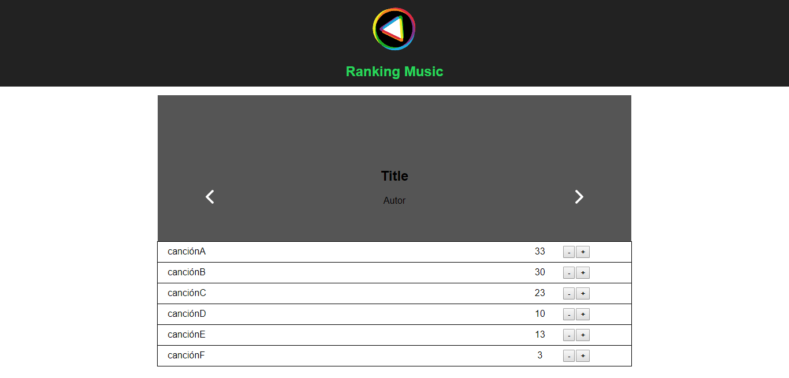

# RANKING MUSIC

* **Track:** _FRONT-END-DEVELOPER_
* **Curso:** _REACT_
* **Unidad:** _5_

***

## Objetivo 

Ranking Music presenta una lista de canciones, a cada una de las canciones se le puede dar puntaje (score) y la lista se ordena de mayor a menor puntaje.

## Especificaciones

Se utilizaron las siguientes herramientas de desarrollo web:
* HTML5
* CSS3
* ES6
* React
* Redux

## Vista previa

## Autoras

* Alejandra C.
* Marina R.
* Rocci E.